# Flouter du texte
* mettre un carré et puis mettre la zone à flouter + transparent + couleur à 70%
* outils Jeff
+ [ ] Refaire slide code floutés présentation @Transactional

# slide avec une seule photo
* Mettre les photos en pleine écran
* Si besoin rajouter un texte lisible

+ [x] Vérifier que toutes les photos sont bien en plein écran ✅ 2026-05-20

# Propagation

* Remplacer les schémas de propagation par des schémas séquentielles style rxjs

+ [x] Modifier les schémas de présentation de la propagation ✅ 2026-05-20

* mettre des cas concrets

* Mettre des bouts de code en faisant apparaitre l'appel entre la méthode mère et la méthode fille
+ [x] Mettre des cas concrets plutôt que méthode fille et mère ✅ 2026-05-20
# Question

Qui utilise les transactions et qui LES MAITRISE

# Demo

Plutôt utiliser des slides qui montrent les résultats de la démo sans la jouer

+ [x] Remplacer la démo propagation par des schémas et du code ✅ 2026-05-20
+ [x] Remplacer la démo isolation par des schémas et du code ✅ 2026-07-07

# Tableau 

Garder le tableau final
Mettre un slide pour chaque anomalie transactionnelle + un slide par isolation
Pour isolation, mettre un pouce vers le haut ou pouce vers le bas

+ [x] Faire un slide par anomalie transactionnelle ✅ 2026-05-20
+ [x] Faire un slide pour chaque isolation ✅ 2026-05-20

# Anti pattern

+ [x] Refaire les slides avec des cas concrets ✅ 2026-07-07

# Divers

+ [x] Supprimer slide présentation ✅ 2026-05-17
+ [x] Mettre logo devlille pour présentation devlille ✅ 2026-05-20
+ [x] Mettre QR code feedback devlille ✅ 2026-07-07
+ [x] Mettre logo breizhcamp pour présentation breizhcamp ✅ 2026-07-07
+ [x] Mettre QR code feedback breizhcamp ✅ 2026-07-07

### Required

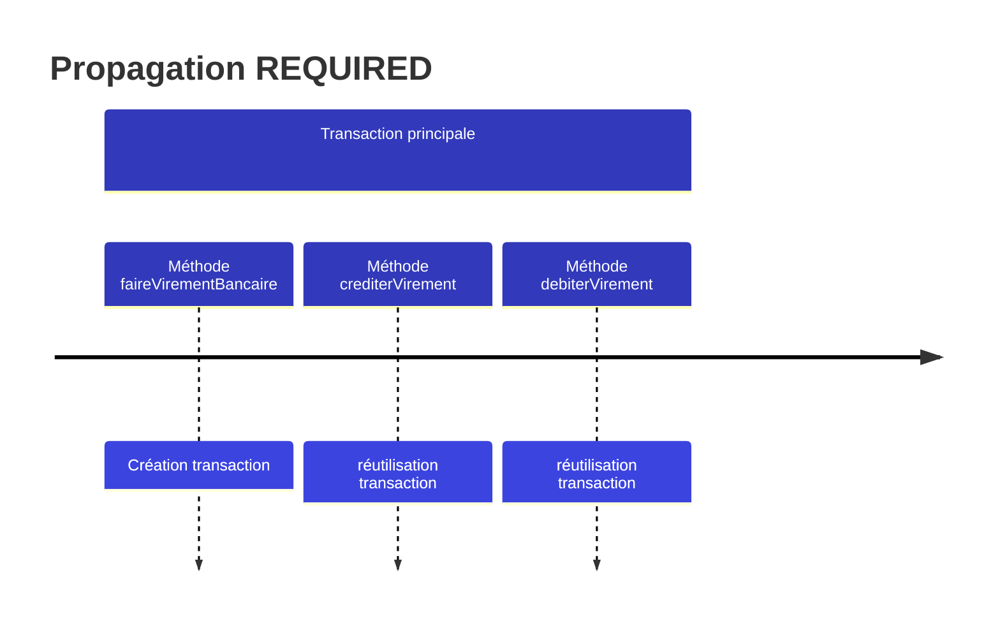
```mermaid
---
config:
  theme: default
  timeline:
  disableMulticolor: true
  themeVariables:
    cScale0: '#3239BA'
    cScaleLabel0: '#ffffff'
    cScale1: '#32BAA8'
    cScaleLabel1: '#ffffff'
    cScale2: '#3239BA'
    cScaleLabel2: '#ffffff'
---
timeline
	title Propagation REQUIRED
			section Transaction principale
				Méthode faireVirementBancaire : Création transaction
				Méthode crediterVirement : réutilisation transaction
				Méthode debiterVirement : réutilisation transaction
			
```

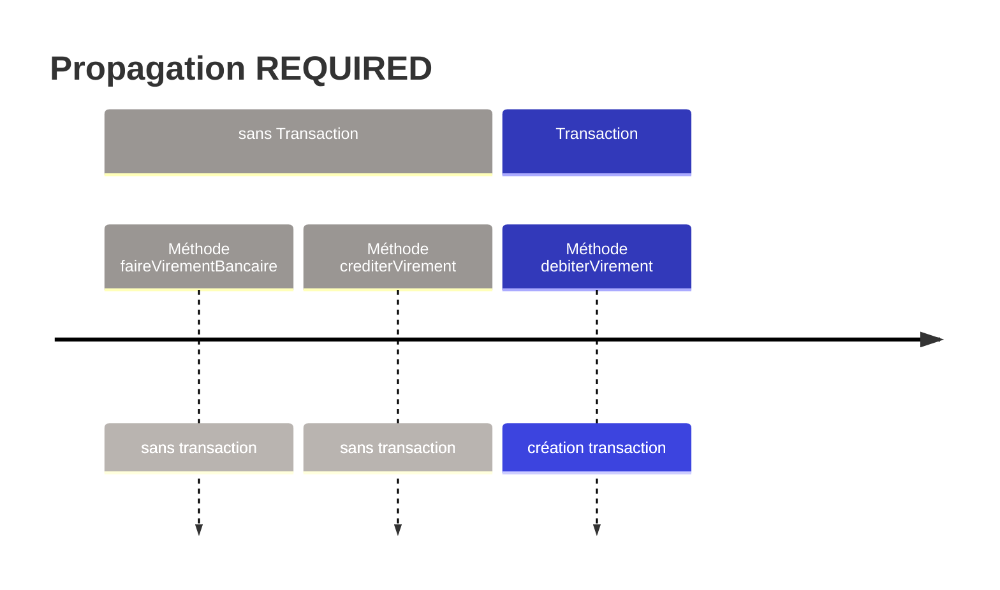
```mermaid
---
config:
  theme: default
  timeline:
  disableMulticolor: true
  themeVariables:
    cScale0: '#9A9693'
    cScaleLabel0: '#ffffff'
    cScale1: '#3239BA'
    cScaleLabel1: '#ffffff'
    cScale2: '#3239BA'
    cScaleLabel2: '#ffffff'
---
timeline
	title Propagation REQUIRED
			section sans Transaction
				Méthode faireVirementBancaire : sans transaction
				Méthode crediterVirement : sans transaction
			section Transaction
				Méthode debiterVirement : création transaction
			
```
### Requires_new

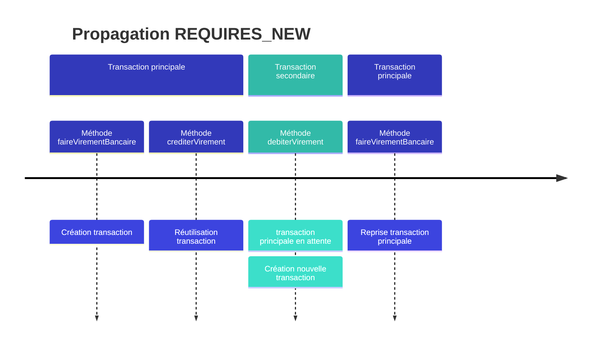
```mermaid
---
config:
  theme: default
  timeline:
  disableMulticolor: true
  themeVariables:
    cScale0: '#3239BA'
    cScaleLabel0: '#ffffff'
    cScale1: '#32BAA8'
    cScaleLabel1: '#ffffff'
    cScale2: '#3239BA'
    cScaleLabel2: '#ffffff'
    cScale3: '#3239BA'
    cScaleLabel3: '#ffffff'
---
timeline
	title Propagation REQUIRES_NEW
			section Transaction principale
				Méthode faireVirementBancaire : Création transaction
				Méthode crediterVirement : Réutilisation transaction
				
			section Transaction secondaire
				Méthode debiterVirement : transaction principale en attente : Création nouvelle transaction
			section Transaction principale 
				Méthode faireVirementBancaire : Reprise transaction principale	
			
```

### Nested

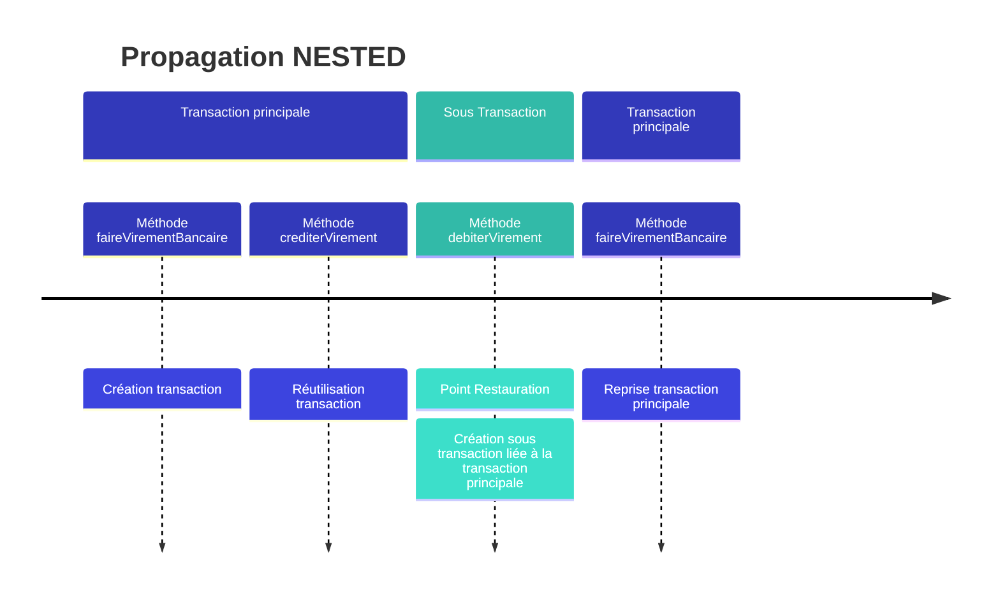
```mermaid
---
config:
  theme: default
  timeline:
  disableMulticolor: true
  themeVariables:
    cScale0: '#3239BA'
    cScaleLabel0: '#ffffff'
    cScale1: '#32BAA8'
    cScaleLabel1: '#ffffff'
    cScale2: '#3239BA'
    cScaleLabel2: '#ffffff'
    cScale3: '#3239BA'
    cScaleLabel3: '#ffffff'
---
timeline
	title Propagation NESTED
			section Transaction principale
				Méthode faireVirementBancaire : Création transaction
				Méthode crediterVirement : Réutilisation transaction
				
			section Sous Transaction
				Méthode debiterVirement : Point Restauration : Création sous transaction liée à la transaction principale
			section Transaction principale 
				Méthode faireVirementBancaire : Reprise transaction principale	
			
```

### Mandatory

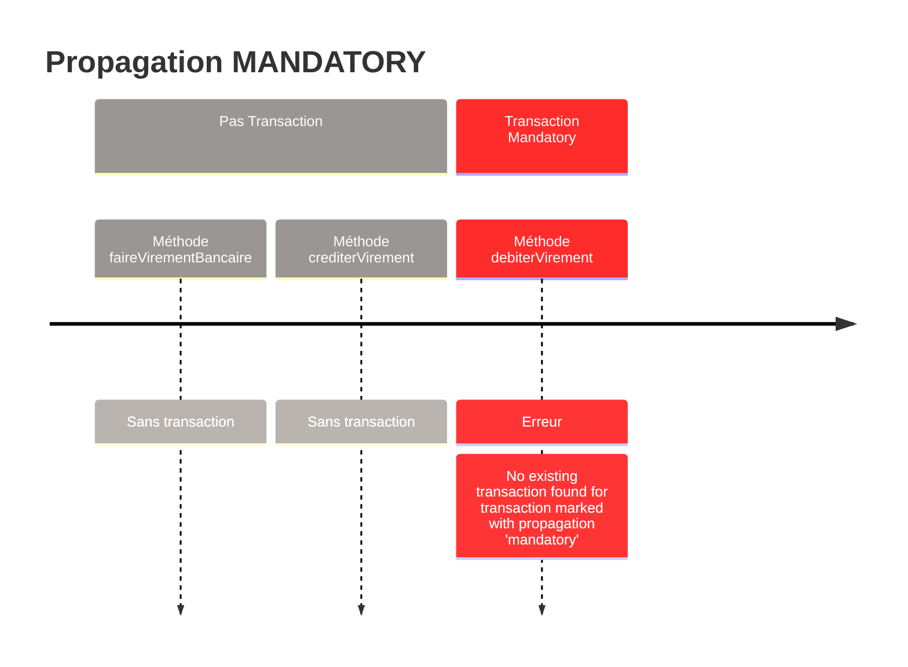
```mermaid
---
config:
  theme: default
  timeline:
  disableMulticolor: true
  themeVariables:
    cScale0: '#9A9693'
    cScaleLabel0: '#ffffff'
    cScale1: '#ff2c2c'
    cScaleLabel1: '#ffffff'
---
timeline
	title Propagation MANDATORY
			Section Pas Transaction
				Méthode faireVirementBancaire : Sans transaction
				Méthode crediterVirement : Sans transaction
				
			section Transaction Mandatory
				Méthode debiterVirement : Erreur: No existing transaction found for transaction marked with propagation 'mandatory'
			
```

### Supports

* Sans transaction

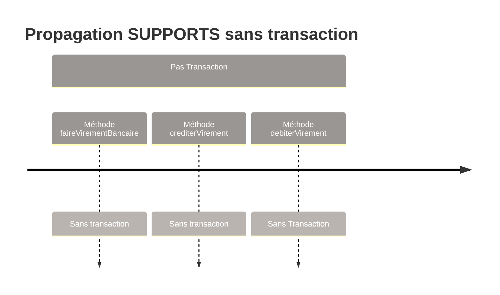
```mermaid
---
config:
  theme: default
  timeline:
  disableMulticolor: true
  themeVariables:
    cScale0: '#9A9693'
    cScaleLabel0: '#ffffff'
    cScale1: '#32BAA8'
    cScaleLabel1: '#ffffff'
    cScale2: '#3239BA'
    cScaleLabel2: '#ffffff'
    cScale3: '#3239BA'
    cScaleLabel3: '#ffffff'
---
timeline
	title Propagation SUPPORTS sans transaction
			Section Pas Transaction
				Méthode faireVirementBancaire : Sans transaction
				Méthode crediterVirement : Sans transaction
				Méthode debiterVirement : Sans Transaction
			
```
* Avec Transaction

```mermaid
---
config:
  theme: default
  timeline:
  disableMulticolor: true
  themeVariables:
    cScale0: '#3239BA'
    cScaleLabel0: '#ffffff'
    cScale1: '#32BAA8'
    cScaleLabel1: '#ffffff'
    cScale2: '#3239BA'
    cScaleLabel2: '#ffffff'
    cScale3: '#3239BA'
    cScaleLabel3: '#ffffff'
---
timeline
	title Propagation SUPPORTS avec transaction
			section Transaction principale
				Méthode faireVirementBancaire : Création transaction
				Méthode crediterVirement : Réutilisation transaction
				Méthode debiterVirement : Réutilisation transaction
			
```
### Never

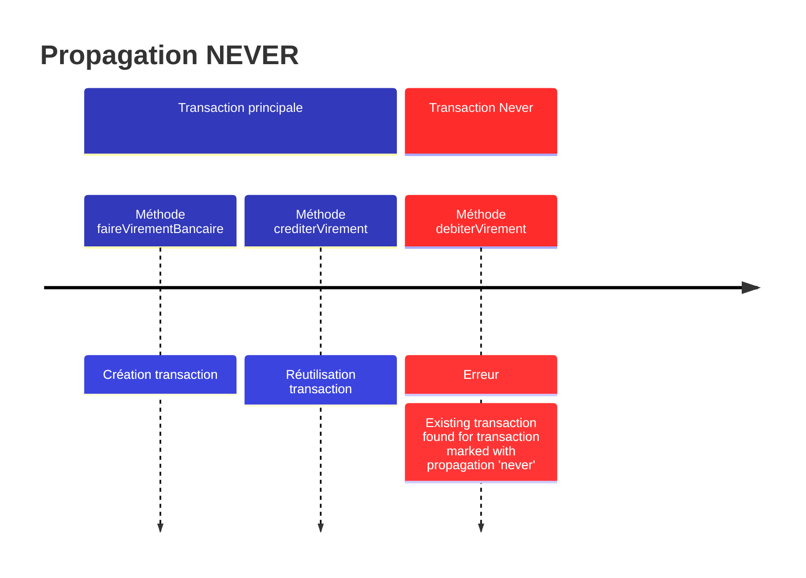
```mermaid
---
config:
  theme: default
  timeline:
  disableMulticolor: true
  themeVariables:
    cScale0: '#3239BA'
    cScaleLabel0: '#ffffff'
    cScale1: '#ff2c2c'
    cScaleLabel1: '#ffffff'
---
timeline
	title Propagation NEVER
			section Transaction principale
				Méthode faireVirementBancaire : Création transaction
				Méthode crediterVirement : Réutilisation transaction
				
			section Transaction Never
				Méthode debiterVirement : Erreur : Existing transaction found for transaction marked with propagation 'never'
			
```

### NotSupported

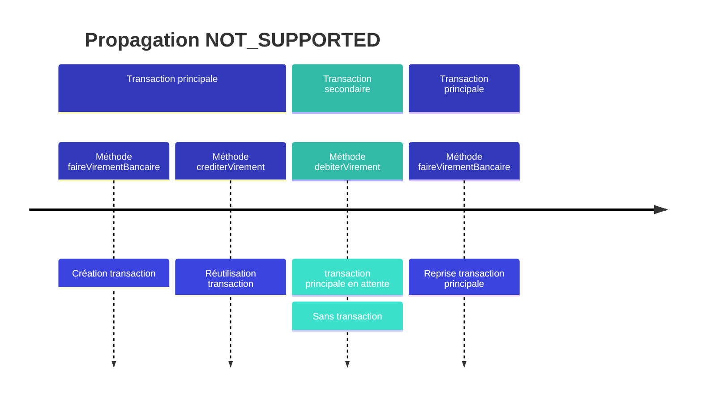
```mermaid
---
config:
  theme: default
  timeline:
  disableMulticolor: true
  themeVariables:
    cScale0: '#3239BA'
    cScaleLabel0: '#ffffff'
    cScale1: '#32BAA8'
    cScaleLabel1: '#ffffff'
    cScale2: '#3239BA'
    cScaleLabel2: '#ffffff'
    cScale3: '#3239BA'
    cScaleLabel3: '#ffffff'
---
timeline
	title Propagation NOT_SUPPORTED
			section Transaction principale
				Méthode faireVirementBancaire : Création transaction
				Méthode crediterVirement : Réutilisation transaction
				
			section Transaction secondaire
				Méthode debiterVirement : transaction principale en attente : Sans transaction
			section Transaction principale 
				Méthode faireVirementBancaire : Reprise transaction principale	
			
```

* Rollback méthode débit
**Required**: Crédit et débit rollbackés
**Requires_New"**:  seul débit rollbacké
**Nested**: seul débit rollbacké

* Rollback après méthode débit 
**Required**: Crédit et débit rollbackés
**Requires_New"**: Seul crédit rollbacké
**Nested**: Crédit et débit rollbackés

# Schéma propagation allégée

### Required

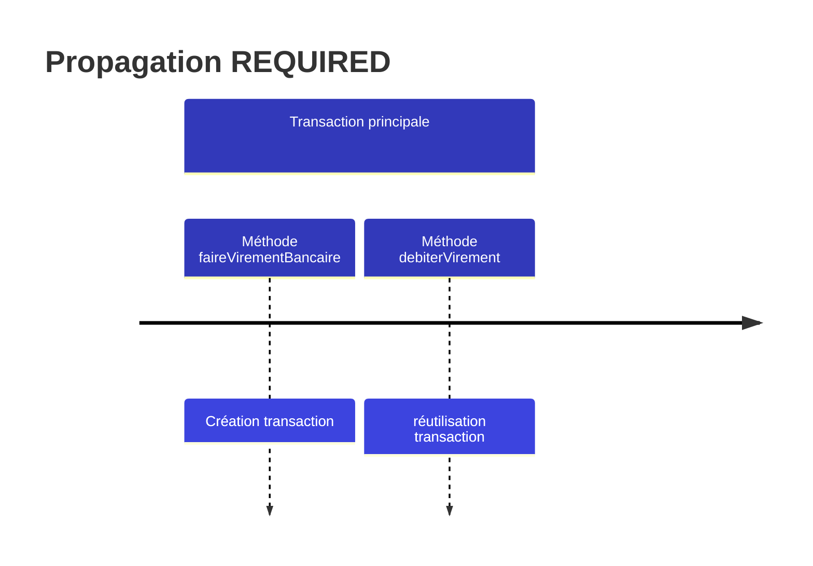
```mermaid
---
config:
  theme: default
  timeline:
  disableMulticolor: true
  themeVariables:
    cScale0: '#3239BA'
    cScaleLabel0: '#ffffff'
    cScale1: '#32BAA8'
    cScaleLabel1: '#ffffff'
    cScale2: '#3239BA'
    cScaleLabel2: '#ffffff'
---
timeline
	title Propagation REQUIRED
			section Transaction principale
				Méthode faireVirementBancaire : Création transaction
				Méthode debiterVirement : réutilisation transaction
			
```

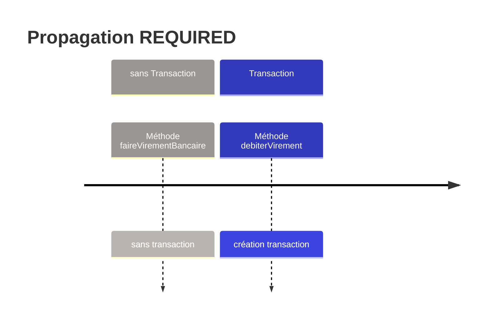
```mermaid
---
config:
  theme: default
  timeline:
  disableMulticolor: true
  themeVariables:
    cScale0: '#9A9693'
    cScaleLabel0: '#ffffff'
    cScale1: '#3239BA'
    cScaleLabel1: '#ffffff'
    cScale2: '#3239BA'
    cScaleLabel2: '#ffffff'
---
timeline
	title Propagation REQUIRED
			section sans Transaction
				Méthode faireVirementBancaire : sans transaction
			section Transaction
				Méthode debiterVirement : création transaction
			
```
### Requires_new

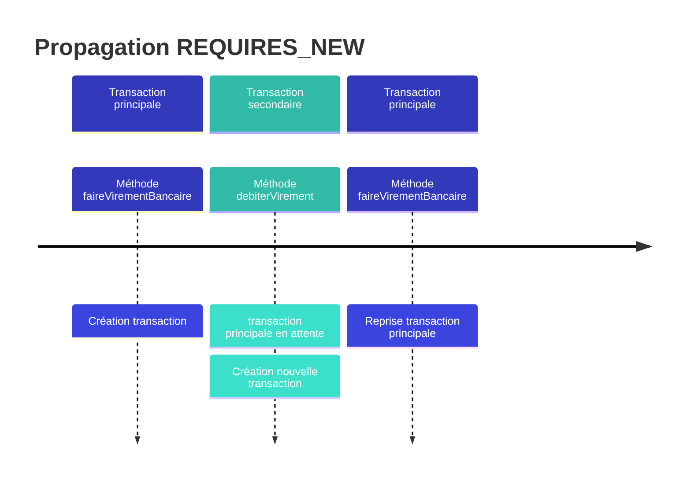
```mermaid
---
config:
  theme: default
  timeline:
  disableMulticolor: true
  themeVariables:
    cScale0: '#3239BA'
    cScaleLabel0: '#ffffff'
    cScale1: '#32BAA8'
    cScaleLabel1: '#ffffff'
    cScale2: '#3239BA'
    cScaleLabel2: '#ffffff'
    cScale3: '#3239BA'
    cScaleLabel3: '#ffffff'
---
timeline
	title Propagation REQUIRES_NEW
			section Transaction principale
				Méthode faireVirementBancaire : Création transaction
				
			section Transaction secondaire
				Méthode debiterVirement : transaction principale en attente : Création nouvelle transaction
			section Transaction principale 
				Méthode faireVirementBancaire : Reprise transaction principale	
			
```

### Nested

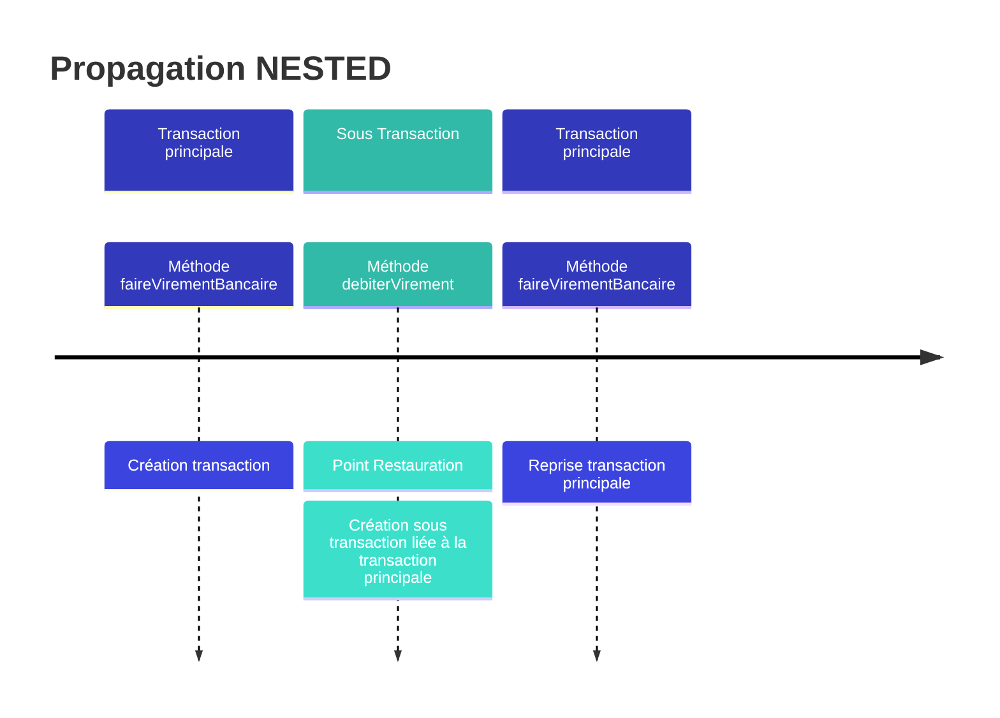
```mermaid
---
config:
  theme: default
  timeline:
  disableMulticolor: true
  themeVariables:
    cScale0: '#3239BA'
    cScaleLabel0: '#ffffff'
    cScale1: '#32BAA8'
    cScaleLabel1: '#ffffff'
    cScale2: '#3239BA'
    cScaleLabel2: '#ffffff'
    cScale3: '#3239BA'
    cScaleLabel3: '#ffffff'
---
timeline
	title Propagation NESTED
			section Transaction principale
				Méthode faireVirementBancaire : Création transaction
				
			section Sous Transaction
				Méthode debiterVirement : Point Restauration : Création sous transaction liée à la transaction principale
			section Transaction principale 
				Méthode faireVirementBancaire : Reprise transaction principale	
			
```

### Mandatory

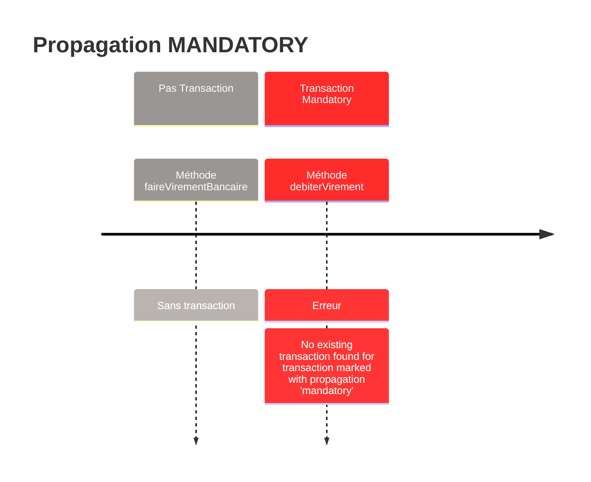
```mermaid
---
config:
  theme: default
  timeline:
  disableMulticolor: true
  themeVariables:
    cScale0: '#9A9693'
    cScaleLabel0: '#ffffff'
    cScale1: '#ff2c2c'
    cScaleLabel1: '#ffffff'
---
timeline
	title Propagation MANDATORY
			Section Pas Transaction
				Méthode faireVirementBancaire : Sans transaction
				
			section Transaction Mandatory
				Méthode debiterVirement : Erreur: No existing transaction found for transaction marked with propagation 'mandatory'
			
```

### Supports

* Sans transaction

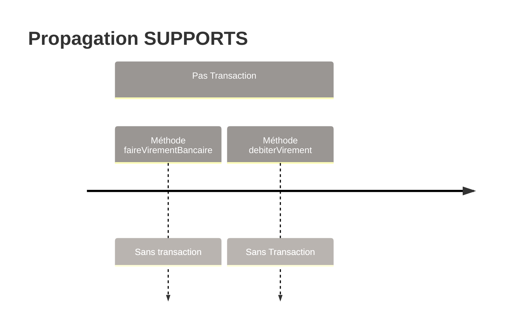
```mermaid
---
config:
  theme: default
  timeline:
  disableMulticolor: true
  themeVariables:
    cScale0: '#9A9693'
    cScaleLabel0: '#ffffff'
    cScale1: '#32BAA8'
    cScaleLabel1: '#ffffff'
    cScale2: '#3239BA'
    cScaleLabel2: '#ffffff'
    cScale3: '#3239BA'
    cScaleLabel3: '#ffffff'
---
timeline
	title Propagation SUPPORTS
			Section Pas Transaction
				Méthode faireVirementBancaire : Sans transaction
				Méthode debiterVirement : Sans Transaction
			
```
* Avec Transaction

```mermaid
---
config:
  theme: default
  timeline:
  disableMulticolor: true
  themeVariables:
    cScale0: '#3239BA'
    cScaleLabel0: '#ffffff'
    cScale1: '#32BAA8'
    cScaleLabel1: '#ffffff'
    cScale2: '#3239BA'
    cScaleLabel2: '#ffffff'
    cScale3: '#3239BA'
    cScaleLabel3: '#ffffff'
---
timeline
	title Propagation SUPPORTS
			section Transaction principale
				Méthode faireVirementBancaire : Création transaction
				Méthode debiterVirement : Réutilisation transaction
			
```
### Never

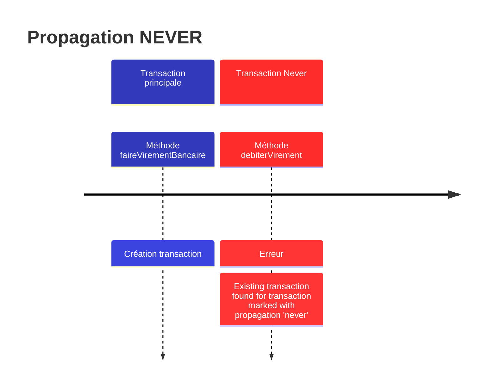
```mermaid
---
config:
  theme: default
  timeline:
  disableMulticolor: true
  themeVariables:
    cScale0: '#3239BA'
    cScaleLabel0: '#ffffff'
    cScale1: '#ff2c2c'
    cScaleLabel1: '#ffffff'
---
timeline
	title Propagation NEVER
			section Transaction principale
				Méthode faireVirementBancaire : Création transaction
				
			section Transaction Never
				Méthode debiterVirement : Erreur : Existing transaction found for transaction marked with propagation 'never'
			
```

### NotSupported

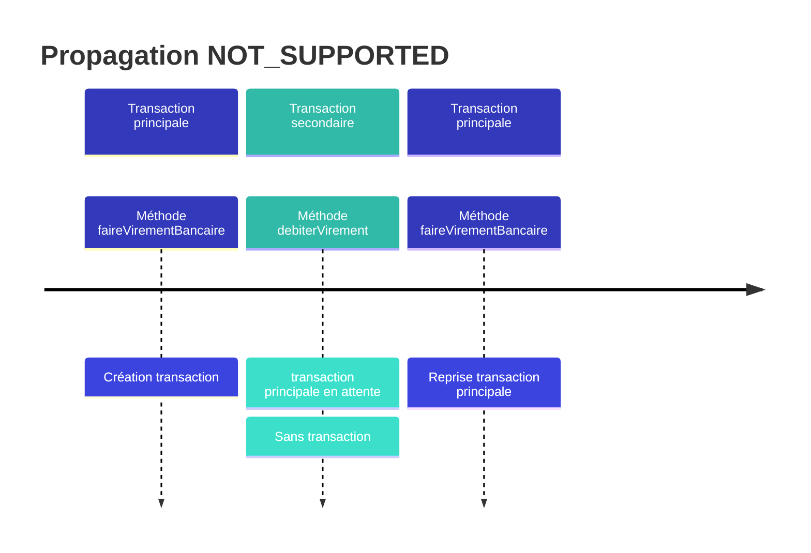
```mermaid
---
config:
  theme: default
  timeline:
  disableMulticolor: true
  themeVariables:
    cScale0: '#3239BA'
    cScaleLabel0: '#ffffff'
    cScale1: '#32BAA8'
    cScaleLabel1: '#ffffff'
    cScale2: '#3239BA'
    cScaleLabel2: '#ffffff'
    cScale3: '#3239BA'
    cScaleLabel3: '#ffffff'
---
timeline
	title Propagation NOT_SUPPORTED
			section Transaction principale
				Méthode faireVirementBancaire : Création transaction
				
			section Transaction secondaire
				Méthode debiterVirement : transaction principale en attente : Sans transaction
			section Transaction principale 
				Méthode faireVirementBancaire : Reprise transaction principale	
			
```

## Anomalie transactionelle
### Dirty read

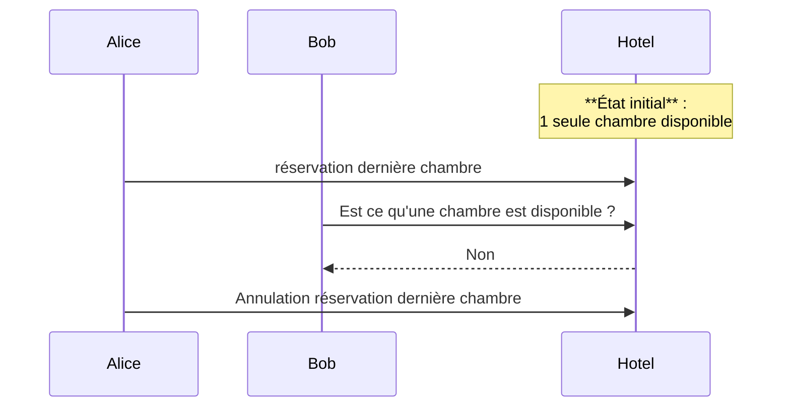
```mermaid
sequenceDiagram
	
	participant Alice as Alice
	participant Bob as Bob
	participant Hotel as Hotel
	
	Note over Hotel: **État initial** :<br/>1 seule chambre disponible
	Alice->>Hotel: réservation dernière chambre
	Bob->>Hotel: Est ce qu'une chambre est disponible ?
	Hotel-->>Bob: Non
	Alice->>Hotel: Annulation réservation dernière chambre
```
### Non repeatable read
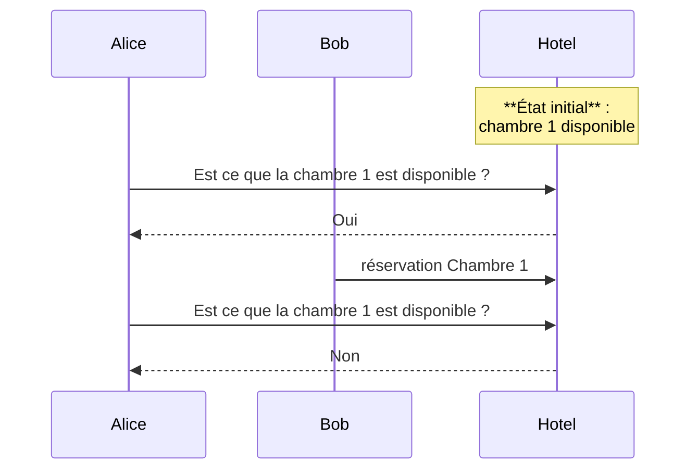
```mermaid
sequenceDiagram
	
	participant Alice as Alice
	participant Bob as Bob
	participant Hotel as Hotel
	
	Note over Hotel: **État initial** :<br/>chambre 1 disponible
	Alice->>Hotel: Est ce que la chambre 1 est disponible ?
	Hotel-->>Alice: Oui
	Bob->>Hotel: réservation Chambre 1
	Alice->>Hotel: Est ce que la chambre 1 est disponible ?
	Hotel-->>Alice: Non
```
### Phantom Read

```mermaid
sequenceDiagram
	
	participant Alice as Alice
	participant Bob as Bob
	participant Hotel as Hotel
	
	Note over Hotel: **État initial** :<br/>3 chambres disponibles
	Alice->>Hotel: Quelles sont les chambres disponibles ?
	Hotel-->>Alice: Trois chambres disponibles: 1, 2 et 3
	Bob->>Hotel: Réservation chambre 1
	Alice->>Hotel: Quelles sont les chambres disponibles ?
	Hotel-->>Alice: Deux chambres disponibles: 2 et 3
```

### Dirty write
```mermaid
sequenceDiagram

	participant Alice as Alice
	participant Bob as Bob
	participant Hotel as Hotel
	
	Note over Hotel: **État initial** :<br/>3 chambres disponibles
	Alice->>Hotel: Quelles chambres sont disponibles ?
	Hotel-->> Alice: 3 chambres sont disponibles: 1, 2 et 3
	Alice->>Hotel: Réservation première chambre disponible
	Hotel-->>Alice: Chambre 1 réservée
	Bob->>Hotel: Réservation première chambre disponible
	Hotel-->>Bob: Chambre 2 réservée
	Alice->>Hotel: Annulation réservation
```

### lost Update
```mermaid
sequenceDiagram
	
	participant Alice as Alice
	participant Bob as Bob
	participant Directeur as Directeur
	participant Hotel as Hotel
	
	Note over Hotel: **État initial** :<br/>chambre 1 disponible
	
	Alice->>Hotel: Est ce que la chambre 1 est disponible ?
	Hotel-->>Alice: Oui
	Bob->>Hotel: Est ce que la chambre 1 est disponible ?
	Hotel-->>Bob: Oui
	Alice->>Hotel: Réservation chambre 1
	Bob->>Hotel: Réservation chambre 1
	Alice->>Hotel: Validation réservation
	Bob->>Hotel: Validation réservation
	Directeur->>Hotel: Qui a réservé chambre 1 ?
	Hotel-->>Directeur: Bob
```

### Write skew
```mermaid
sequenceDiagram
	
	participant Alice as Alice
	participant Bob as Bob
	participant Hotel as Hotel
	
	Note over Hotel: **État initial** :<br/>2 chambres disponibles<br/>1 petit déjeuner disponible
	Alice->>Hotel: Combien reste t'il de chambre de disponible ?
	Hotel-->>Alice: 2 chambres
	Alice->>Hotel: Combien reste t'il de petit déjeuner de disponible ?
	Hotel-->>Alice: 1 petit déjeuner
	Bob->>Hotel: Combien reste t'il de chambre de disponible ?
	Hotel-->>Bob: 2 chambres
	Bob->>Hotel: Combien reste t'il de petit déjeuner de disponible ?
	Hotel-->>Bob: 1 petit déjeuner
	Alice->>Hotel: Réservation chambre et petit déjeuner
	Bob->>Hotel: Réservation chambre et petit déjeuner
	Hotel-->>Alice: Réservation chambre et petit déjeuner effectuée
	Hotel-->>Bob: Réservation chambre et <p style="color:#FF0000;"> petit déjeuner effectuée </p>

```

# Entrainement

+ [x] Ajouter les explications des anomalies transactional manquantes ✅ 2026-06-06
+ [x] réorganiser les exemples de propagation ✅ 2026-06-06
+ [x] corriger la propagation supported sans transaction ✅ 2026-06-06
+ [x] Refaire un point sur les diagrammes de séquence ✅ 2026-07-07
	+ [x] certains rollback sont inutiles ✅ 2026-06-07
	+ [x] l manque des questions ✅ 2026-06-07
	+ [x] write skew illustrés le fat qu'il manque un petit déjeuner) ✅ 2026-06-07
+ [x] Dans la démo de l"isolation ✅ 2026-07-07
	+ [x] revoir les diapos pour que le public comprenne les différentes étapes ✅ 2026-07-07
+ [x] Mettre en jour les cas d'erreurs de la propagation ✅ 2026-06-06
	+ [x] Mandatory ✅ 2026-06-06
	+ [x] Never ✅ 2026-06-06